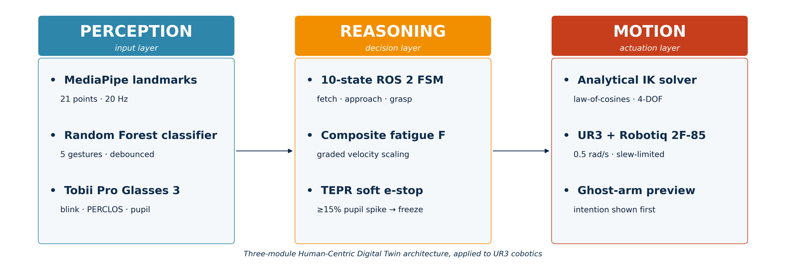
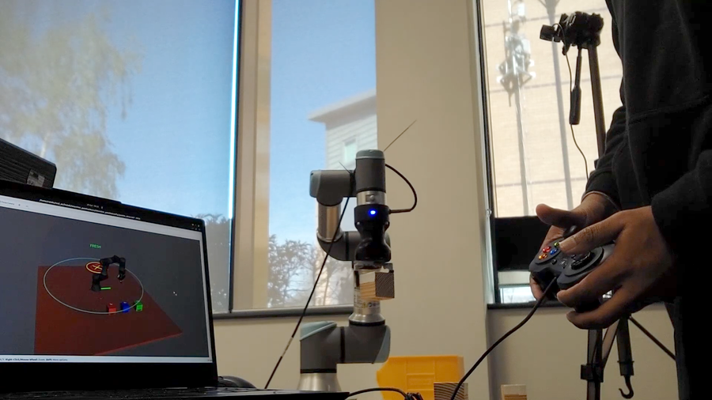
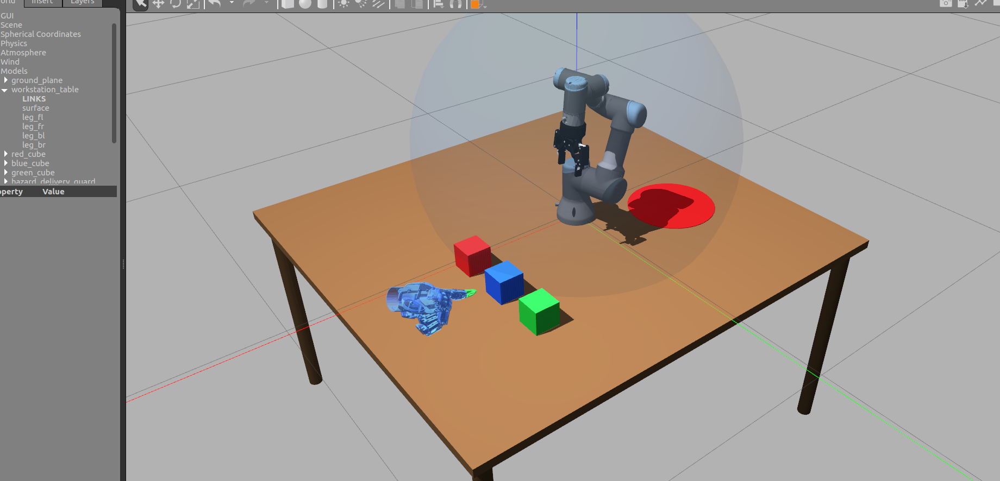
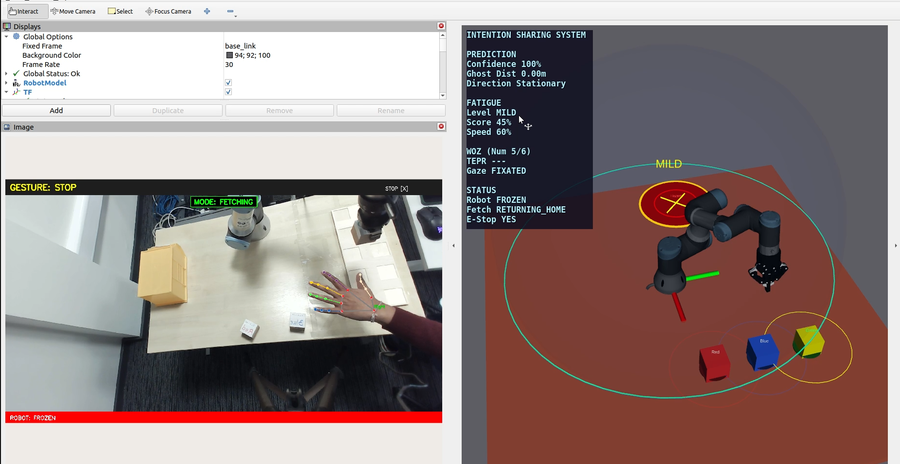
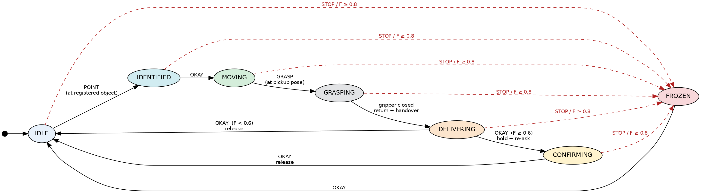
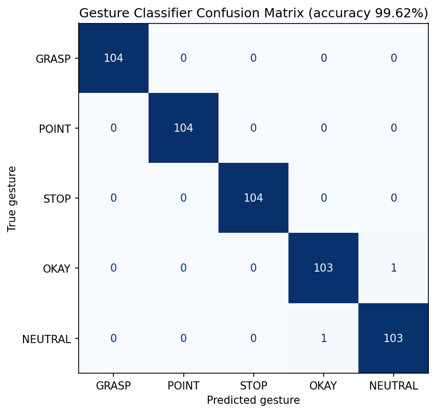

# Predictive Fatigue-Aware Human-Robot Collaboration

A ROS 2 implementation of an operator-state-aware collaborative-robot pipeline that adjusts a UR3 cobot's speed, motion commitment, and emergency-stop behaviour from live hand-gesture and pupillometry signals.



This repository accompanies the Frontiers in Robotics and AI paper *Predictive Fatigue-Aware Human-Robot Collaboration* (Goonetilleke and Khalid, 2026). The system targets the closed-loop feedback gap identified by recent Human-Centric Digital Twin (HCDT) literature: industrial cobots react to physical contact but ignore the cognitive and physiological state of the person standing next to them. Industry 5.0 frameworks call for operator-state-aware co-working, but real implementations on standard cobots remain rare.

What this repo delivers is a working end-to-end pipeline (perception, reasoning, motion) running on commodity hardware: a UR3 with a Robotiq 2F-85 gripper, a USB webcam, and Tobii Pro Glasses 3. Each module is independently testable, the inverse-kinematics solver is closed-form (no MoveIt overhead), and the deployed classifier achieves 99.62% test accuracy on a leak-free evaluation split. A Gazebo simulation path is included for reviewers without access to the physical cell.

## Hardware



- Universal Robots UR3 (Polyscope 5.x)
- Robotiq 2F-85 adaptive gripper
- RGB webcam (any 720p+ USB camera; tested on a Logitech C920)
- Tobii Pro Glasses 3 (for live pupillometry; optional, see below)
- Linux laptop with Ubuntu 22.04 and at least 8 GB RAM

The simulation path (`complete_system.launch.py` without `use_ur_driver:=true`) runs the entire pipeline against a Gazebo UR3, so no physical robot or eye-tracker is needed to reproduce the gesture and fatigue logic.



## How it works

**Perception.** A single MediaPipe Hands inference loop runs at 20 Hz, producing 21 normalised landmarks per detected hand. The landmarks are flattened, wrist-centred, and passed to a Random Forest classifier that emits one of five gestures: POINT, STOP, OKAY, GRASP, NEUTRAL. A five-layer noise-suppression chain sits between the classifier and the command publisher: MediaPipe confidence floor, visibility quality gate, velocity gate (freezes landmarks during fast transitions), classifier confidence threshold, and a 10-frame consecutive-frame debounce. STOP is treated as safety-critical and uses a faster 2-frame debounce so the operator can halt the robot within roughly 100 ms of raising their hand.



In parallel, the Tobii Pro Glasses 3 node streams pupil diameter, blink rate, blink duration, and PERCLOS at 10 Hz.

**Reasoning.** A composite fatigue score F fuses four normalised signals with weights 0.30 (blink rate), 0.25 (blink duration), 0.30 (PERCLOS), and 0.15 (hand jerk). The smoothed score is banded into FRESH (less than 0.30), MILD (less than 0.60), MODERATE (less than 0.80), and SEVERE (above 0.80). The band gates the rest of the system: velocity scales 100% / 70% / 40% / 15% across the bands and falls to 0% at full lockout, and the MODERATE band requires an OKAY confirmation gesture before any new fetch is committed. A separate acute-stress pathway watches pupil diameter against a 3-second rolling baseline; a spike of 15% or more latches a soft emergency-stop within roughly 200 ms end-to-end. The fetch behaviour itself runs as a ten-state finite-state machine (idle, identified, homing, pre-approach, approach, waiting-grasp, grasping, returning, delivering, waiting-receive).



**Motion.** Cartesian targets from the perception layer are converted to UR3 joint angles by a closed-form analytical inverse-kinematics solver: three free joints (shoulder pan, shoulder lift, elbow) reach the (x, y, z) target via a law-of-cosines elbow formulation, one constrained wrist-pitch joint maintains a vertical end-effector orientation, and the remaining two wrist axes are locked at fixed values for the top-down grasping configuration. Joint commands are workspace-clamped and passed through a slew-rate-limited velocity controller before being published on the scaled joint trajectory topic, ensuring deterministic 20 Hz output on a single CPU core.

## Results



The deployed Random Forest reaches **99.62% accuracy (518 of 520)** on a leak-free split-then-augment evaluation: the 2,600 raw samples are stratified-split 80/20 first, then mirror augmentation is applied only to the training fold (4,160 train / 520 raw test). Both errors fall in the Okay/Neutral confusion region, which the geometric override layer in `camera_node.py` catches before the gesture is committed, raising effective system-level accuracy to 100%. End-to-end gesture-to-motion latency is approximately 550 ms worst case, dominated by the 10-frame consecutive-frame debounce window. A three-classifier comparison (RF, MLP, KNN) on the same split is reproducible via `compare_classifiers.py`.

## Quick start

### 1. System dependencies

- Ubuntu 22.04
- ROS 2 Humble (install via [the official guide](https://docs.ros.org/en/humble/Installation.html))
- Gazebo Classic 11 (for simulation)

### 2. Python dependencies

```bash
pip3 install -r requirements.txt
```

Optional extras: `matplotlib` for regenerating the plots in `src/report/plots/`, and `g3pylib` if you intend to stream live Tobii Pro Glasses 3 data instead of using the simulated pupillometry source.

### 3. Third-party ROS packages

These are gitignored from this repo and must be cloned separately into `src/`:

```bash
cd ~/ros2_ws/src
git clone https://github.com/IFRA-Cranfield/IFRA_LinkAttacher.git
git clone https://github.com/ros-controls/gazebo_ros2_control.git
git clone https://github.com/PickNikRobotics/ros2_robotiq_gripper.git
git clone https://github.com/wjwwood/serial.git
```

The Universal Robots ROS 2 driver is installed via apt (`sudo apt install ros-humble-ur`).

### 4. Build

```bash
cd ~/ros2_ws
colcon build
source install/setup.bash
```

Build-shortcut (single package):

```bash
cd ~/ros2_ws && colcon build --packages-select vision_input && source install/setup.bash
```

### 5. Run

Simulation:

```bash
ros2 launch vision_input complete_system.launch.py
```

Real UR3 (two terminals):

```bash
# Terminal 1 — UR driver
ros2 launch ur_robot_driver ur_control.launch.py \
  ur_type:=ur3 robot_ip:=192.168.1.10 \
  launch_rviz:=true use_fake_hardware:=false

# Terminal 2 — application layer
ros2 launch vision_input complete_system.launch.py use_ur_driver:=true
```

Then load the `intention_pred_model` program on the UR3 pendant and press Play. See [commands.txt](commands.txt) for the full reference covering network setup, debug topics, and safety checklist.

## Repository structure

```
ros2_ws/
├── src/
│   ├── vision_input/        Perception, fatigue, robot control, training scripts
│   │   ├── vision_input/    Python nodes (camera_node, robot_controller, fatigue_monitor, tobii_node)
│   │   ├── launch/          complete_system.launch.py, ar_demo.launch.py
│   │   └── rviz/
│   ├── intention_gazebo/    UR3 + Robotiq Gazebo cell, URDF, worlds, controllers
│   │   ├── launch/          gazebo_sim.launch.py, real_ur3.launch.py
│   │   ├── urdf/
│   │   ├── worlds/
│   │   └── meshes/
│   └── report/plots/        Figures used in the paper (architecture, FSM, confusion matrix)
├── data/                    Training CSVs, deployed model, calibration config
└── commands.txt             Quick command reference
```

## Reproducing the paper results

1. **Retrain the gesture classifier** on the bundled CSVs (`data/grasp.csv`, `point.csv`, `stop.csv`, `okay.csv`, `neutral.csv`):

   ```bash
   cd ~/ros2_ws/src/vision_input/vision_input
   python3 train_model.py
   ```

   Expected output: dataset of 2,600 raw samples (520 per class), 4,160 training samples after mirror augmentation, 520 raw test samples, Random Forest accuracy 99.62%, two errors both Okay/Neutral. The model is saved to `data/gesture_brain.joblib`.

2. **Regenerate the comparison table** (RF vs MLP vs KNN, the contents of Table X in the paper):

   ```bash
   python3 compare_classifiers.py
   ```

   Expected output: 99.62% / 100.00% / 100.00% accuracy on the same leak-free split, with inference latencies (microseconds per sample) printed in a markdown-formatted table at the bottom of stdout.

3. **Regenerate the confusion matrix figure** (used in `src/report/plots/confusion_matrix.png`): `[TBD: confirm command]`. The values used in the published figure are emitted directly by `train_model.py` as the `CONFUSION MATRIX` block in stdout.

4. **Regenerate the gesture-latency figure** (Figure 11): `[TBD: confirm command]`. The underlying timing data is recorded by `camera_node.py` to `data/latency_log.csv` during live runs.

## Citing this work

```bibtex
@article{goonetilleke2026predictive,
  title   = {Predictive Fatigue-Aware Human-Robot Collaboration},
  author  = {Goonetilleke, Ranidu P. and Khalid, Azfar},
  journal = {Frontiers in Robotics and AI},
  year    = {2026},
  note    = {[TBD: confirm DOI on acceptance]}
}
```

## Licence

MIT, see [LICENSE](LICENSE).
